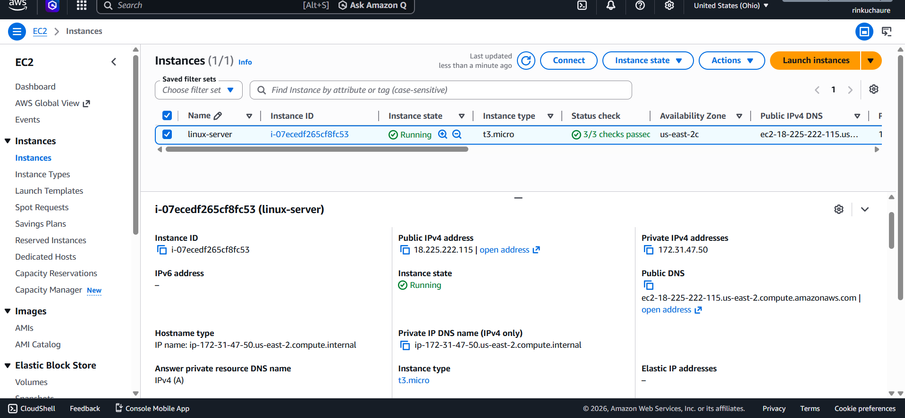
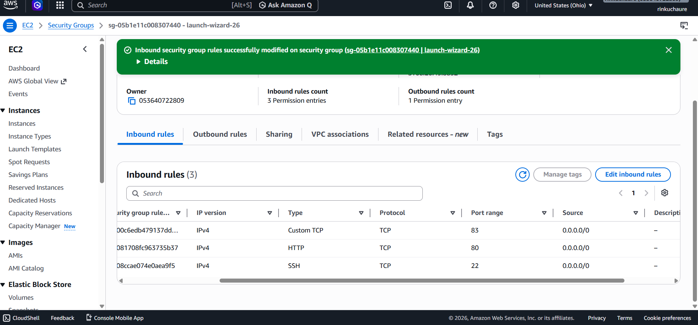
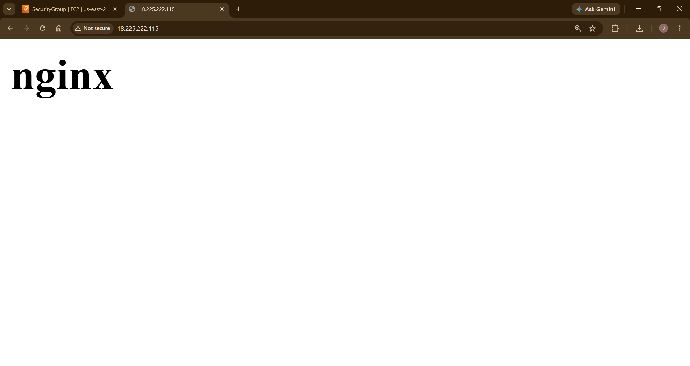
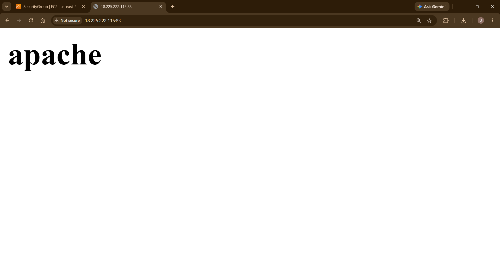
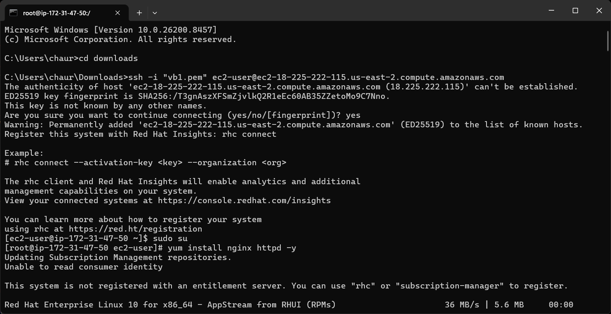
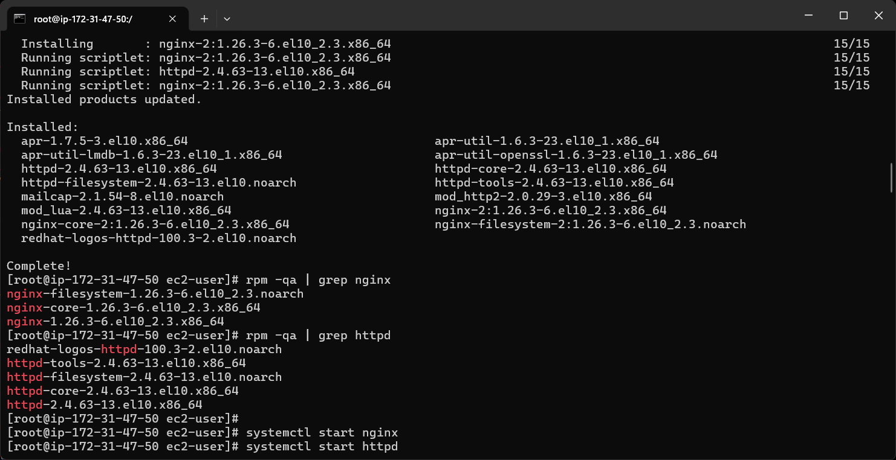
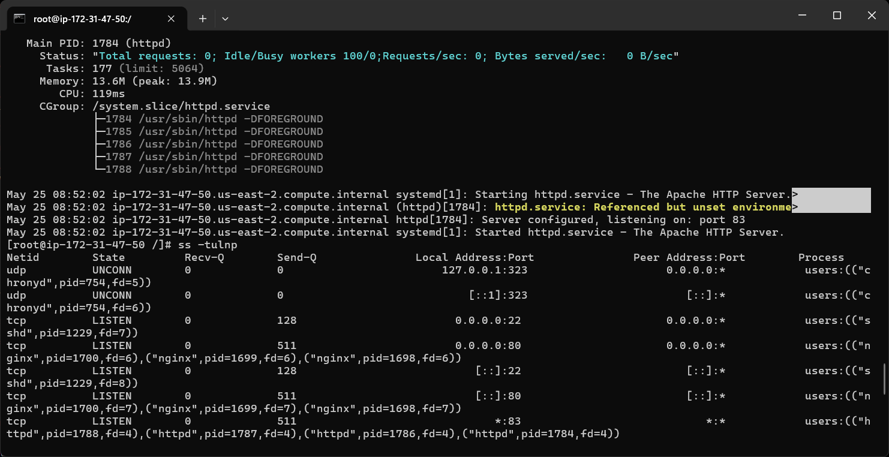

# 🚀 NGINX + HTTPD Troubleshooting Lab on AWS EC2


---

# 📌 Project Overview

This project demonstrates real-world Linux web server troubleshooting using NGINX and Apache HTTP Server on a single AWS EC2 instance.

The lab includes:

- NGINX configuration on port 80
- Apache HTTP Server configuration on custom port 83
- Linux troubleshooting
- Port conflict troubleshooting
- SELinux troubleshooting
- Security Group configuration
- Service validation
- Networking verification
- Git & GitHub documentation

This project helped build practical understanding of Linux administration, web server troubleshooting, and AWS networking concepts.

---

# 🎯 Project Objective

The objective of this project is to configure and troubleshoot multiple web servers running simultaneously on a single Linux EC2 instance.

### Key Objectives

- Configure NGINX on port 80
- Configure Apache on custom port 83
- Resolve port conflicts
- Troubleshoot SELinux issues
- Configure AWS Security Groups
- Validate Linux networking
- Practice Linux administration
- Build professional GitHub documentation

---

# 🏗️ Architecture Diagram

```text
AWS Cloud (us-east-2)
│
├── VPC
│
├── EC2 Instance (linux-server)
│   │
│   ├── NGINX
│   │    └── Port 80
│   │
│   └── Apache HTTPD
│        └── Port 83
│
├── Security Group
│    ├── SSH → 22
│    ├── HTTP → 80
│    └── Custom TCP → 83
│
└── Browser Access
      ├── http://PUBLIC-IP
      └── http://PUBLIC-IP:83
```

---

# 📂 Repository Structure

```text
nginx-httpd-troubleshooting-lab/
│
├── README.md
│
├── screenshots/
│   ├── 01-ec2-instance-running.png
│   ├── 02-security-group-rules.png
│   ├── 03-nginx-browser-output.png
│   ├── 04-apache-browser-output-port83.png
│   ├── 05-package-installation-and-verification.png
│   ├── 06-port-verification-ss-command.png
│   └── 07-journalctl-httpd-troubleshooting.png
│
├── commands/
│   ├── nginx-httpd-commands.md
│   ├── selinux-commands.md
│   ├── ss-commands.md
│   ├── journalctl-commands.md
│   └── troubleshooting-commands.md
│
├── notes/
│   ├── nginx-notes.md
│   ├── apache-notes.md
│   ├── selinux-notes.md
│   ├── journalctl-notes.md
│   └── troubleshooting-notes.md
│
└── docs/
    └── project-flow.md
```


---

# 🌍 AWS Region

```text
us-east-2 (Ohio)
```

---

# 🧰 Technologies Used

| Technology | Purpose |
|---|---|
| AWS EC2 | Linux Server |
| NGINX | Web Server |
| Apache HTTPD | Web Server |
| Linux | Server Administration |
| Security Groups | Traffic Control |
| SELinux | Linux Security |
| Git & GitHub | Version Control |

---

# ✅ Prerequisites

- AWS Account
- EC2 Key Pair
- Basic Linux Knowledge
- Networking Fundamentals
- Git & GitHub
- SSH Client

---

# 🚀 Lab Implementation Steps

## Step 1: Launch EC2 Instance

Created RedHat Linux EC2 instance.

| Configuration | Value |
|---|---|
| Instance Name | linux-server |
| Instance Type | t3.micro |
| Region | us-east-2 |
| Operating System | RedHat Linux |

---

## Step 2: Configure Security Group

Configured inbound rules:

| Protocol | Port | Purpose |
|---|---|---|
| SSH | 22 | Remote Access |
| HTTP | 80 | NGINX Access |
| Custom TCP | 83 | Apache Access |

---

## Step 3: Install NGINX & Apache

Installed packages:

```bash
yum install nginx httpd -y
```

---

## Step 4: Configure NGINX

Started nginx:

```bash
systemctl start nginx
```

Enabled nginx:

```bash
systemctl enable nginx
```

Configured webpage:

```html
<h1>nginx</h1>
```

---

## Step 5: Configure Apache HTTPD

Edited configuration:

```bash
vi /etc/httpd/conf/httpd.conf
```

Changed:

```apache
Listen 80
```

To:

```apache
Listen 83
```

Configured webpage:

```html
<h1>apache</h1>
```

---

## Step 6: Troubleshooting Apache Failure

Initially Apache failed because:

- Port conflict
- SELinux restrictions

Checked logs using:

```bash
journalctl -xeu httpd
```

Verified ports using:

```bash
ss -tulnp
```

---

## Step 7: SELinux Troubleshooting

Temporary fix:

```bash
setenforce 0
```

Permanent fix:

```bash
yum install policycoreutils-python-utils -y
```

```bash
semanage port -a -t http_port_t -p tcp 83
```

---

## Step 8: Validate Services

Checked service status:

```bash
systemctl status nginx
```

```bash
systemctl status httpd
```

---

## Step 9: Browser Validation

### NGINX

```text
http://PUBLIC-IP
```

Output:

```text
nginx
```

---

### APACHE

```text
http://PUBLIC-IP:83
```

Output:

```text
apache
```

---

# 🐧 Linux Commands Used

| Command | Purpose |
|---|---|
| `systemctl status httpd` | Check Apache status |
| `systemctl restart nginx` | Restart nginx |
| `journalctl -xeu httpd` | Apache troubleshooting logs |
| `ss -tulnp` | Check listening ports |
| `httpd -t` | Verify Apache syntax |
| `nginx -t` | Verify nginx syntax |
| `setenforce 0` | Disable SELinux temporarily |
| `semanage port -a -t http_port_t -p tcp 83` | Allow custom port |

---

# 📸 Screenshots


## 1. EC2 Instance Running



---

## 2. Security Group Rules



---

## 3. NGINX Browser Output



---

## 4. Apache Browser Output on Port 83



---

## 5. Package Installation and Verification



---

## 6. Port Verification using ss Command



---

## 7. journalctl HTTPD Troubleshooting


---

# 🔐 Security Concepts Learned

- SELinux
- Linux port security
- AWS Security Groups
- Service isolation
- Custom port management

---

# ⚠️ Challenges Faced

- Apache port conflict
- SELinux blocking custom ports
- Security Group configuration
- Service troubleshooting
- Port validation

---

# 🧠 Key Learning Outcomes

After completing this project, I learned:

- Linux troubleshooting
- NGINX configuration
- Apache configuration
- SELinux troubleshooting
- AWS Security Groups
- Linux networking
- Service management
- Log analysis
- Port troubleshooting
- Real-world DevOps troubleshooting workflow

---

# 🧹 Cleanup

All AWS resources created during this lab were deleted after testing to avoid unnecessary AWS billing charges.

---

# 🚀 Future Improvements

- Configure Reverse Proxy
- Add HTTPS with SSL
- Configure Load Balancer
- Automate using Terraform
- Add Monitoring
- Configure Docker Containers

---

# 👩‍💻 Author

**Jaishree Chaure**

Passionate about AWS, Linux, Networking, and DevOps Engineering.  
Currently building hands-on cloud and infrastructure projects to strengthen practical skills in AWS and DevOps.

🔗 GitHub: https://github.com/Jaishree97